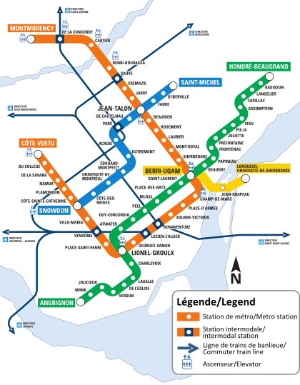

# Graph_homework
Файл с отчет и кодами: "graph_homework_sokolov.ipynb"

Все данные в стиле csv

Для задания я взял метро Рима в качестве большого:

.png)

взял метро Монреаля в качестве стреднего:

и взял метро Пхеньяна в качестве малого:

